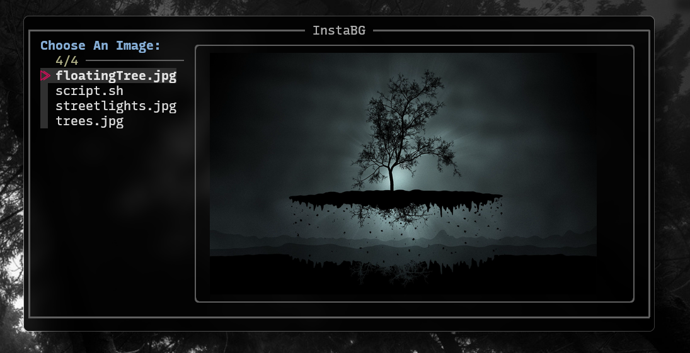

# InstaBG - A Fast and Intuitive Wallpaper Setter



InstaBG is a simple yet powerful tool that allows you to quickly browse and set wallpapers using `fzf` with image previews. It leverages `kitty` for image rendering and `xwallpaper` for setting the wallpaper, providing a seamless and efficient experience.

## Features

- **Interactive Wallpaper Selection** – Browse wallpapers with `fzf`'s fuzzy search.
- **Live Image Previews** – View wallpapers before applying them using `kitty`.
- **Quick and Lightweight** – Uses `xwallpaper` to instantly apply wallpapers.
- **Customizable** – Easily configure the directories where your wallpapers are stored.

## Dependencies

Ensure you have the following dependencies installed before using InstaBG:

- [`fzf`](https://github.com/junegunn/fzf) – A command-line fuzzy finder.  
- [`kitty`](https://sw.kovidgoyal.net/kitty/) – A feature-rich terminal that supports image previews.  
- [`xwallpaper`](https://github.com/stoeckmann/xwallpaper) – A lightweight wallpaper setter for X11.

## Installation

Clone the repository:

```bash
git clone https://github.com/jdpedersen1/instabg.git
cd instaBG
```

Make the script executable:

```bash
chmod +x instaBG.sh
```

## Configuration

Before running the script, you may need to modify the `PAPERS` and `DIR` variables inside `instaBG.sh` to point to your wallpaper directory.

Example:

```bash
PAPERS="$HOME/Pictures/Wallpapers"
DIR="$PAPERS"
```

## Usage

Simply run the script to launch the wallpaper selector:

```bash
./instaBG.sh
```

Use `fzf` to browse and select a wallpaper. Once selected, it will be applied immediately using `xwallpaper`.

## License

This project is released under the MIT License.


